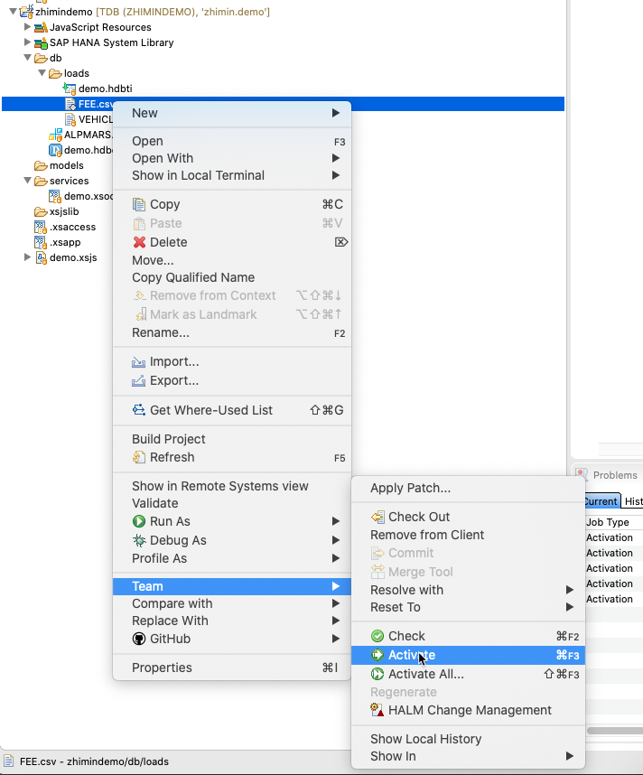

## 建立数据导入

配置文件 zhimin/demo/db/loads/demo.hdbti

``` js
import = [
    {
        cdstable = "zhimin.demo.db::demo.VEHICLE";
        file = "zhimin.demo.db.loads:VEHICLE.csv";
        header = true;
        useHeaderNames = true;
    },
    {
        cdstable = "zhimin.demo.db::demo.FEE";
        file = "zhimin.demo.db.loads:FEE.csv";
        header = true;
        delimField = ";";
        useHeaderNames = true;
    }
];

```

数据文件 VEHICLE.csv

``` csv 
UID,VIN,ENGINE_NO,PLATE_NUMBER,DOC_NUMBER,CARD_ID,LICENSE_VALID_FROM,LICENSE_VALID_TO,OP_CERT_NUMBER,OP_CERT_VALID_FROM,OP_CERT_VALID_TO,MAKER,MODEL,PURCHASE_DATE
1,LFWSRXSJ4KAD14686,53170940,豫NR5926,411401082943,4150028005042,20190417,20200401,411406000775,20190422,20200430,解放,重型半挂牵引车,20190417
```

数据文件 FEE.csv
``` csv
UID;REF_VEHICLE.UID;CREATED_ON;CREATED_BY;CHANGED_ON;CHANGED_BY;FEE_START_DATE;FEE_END_DATE;FEE;CURRENCY_CODE;DELETE_FLAG
D1BE04B044C5AAEA16004C0016A69737;10000000;20191220060934;ZHIMIN.SHAO@SAP.COM;20191220060934;ZHIMIN.SHAO@SAP.COM;20190630;20190730;120;CNY;0
```

## 激活文件

