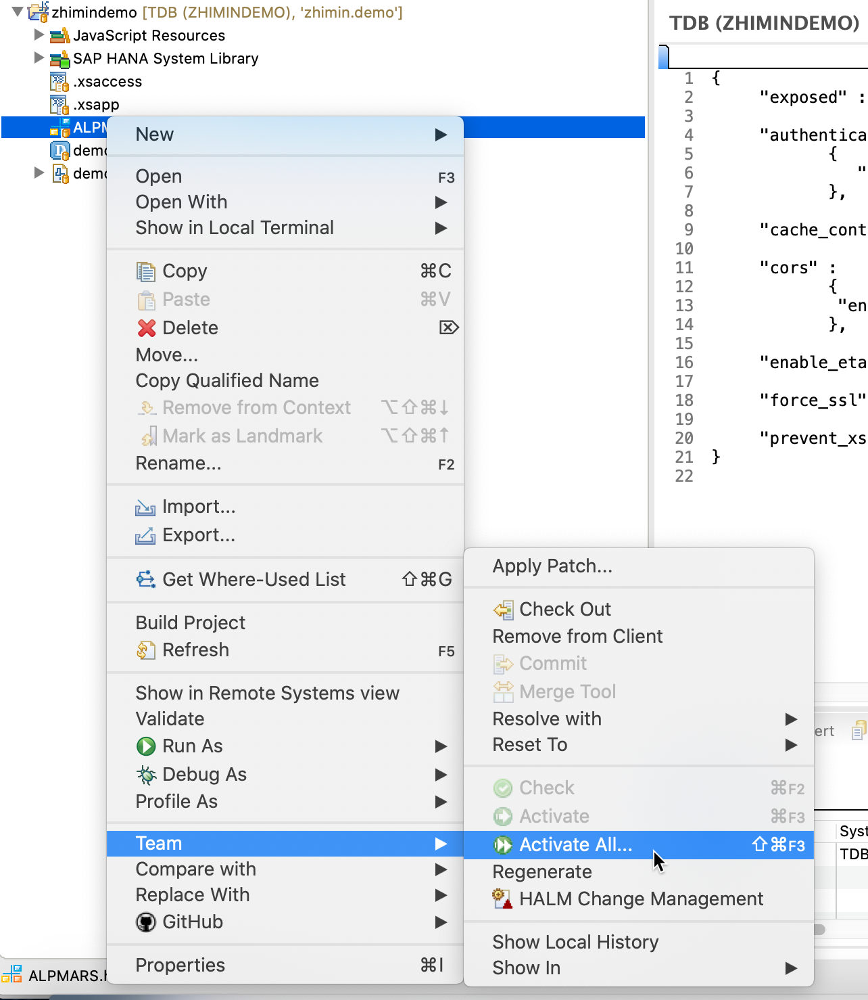
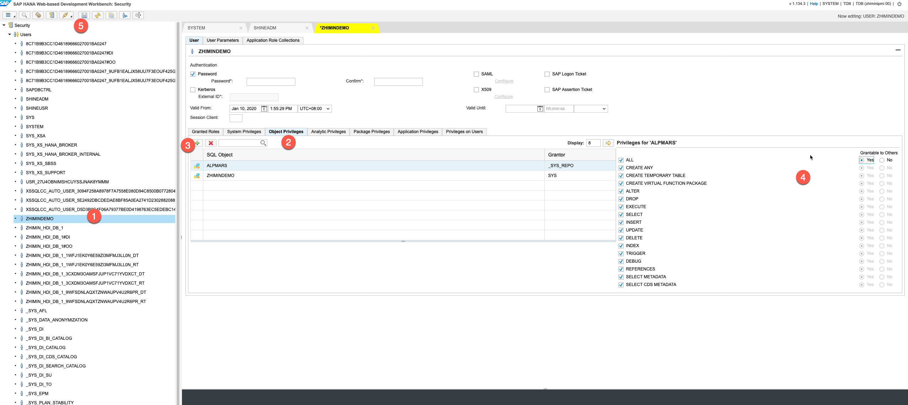

## 文件后缀解释
* hdbschema - 建立数据库 schema 使用的文件，文件名为 schema 的名字，ALPMARS.hdbschema 文件内容
``` js
//To define the HDB schema, you can use the following code: 

schema_name = "ALPMARS";

```

说明: 上述文件激活以后，还需要配置相关的 object 权限，用户才能够看到。

* .xsapp - 一个空文件

* .xsaccess - 配置web服务相关的一些访问控制或者安全设置，文件内容如下:
``` js
{
     "exposed" : true,  
                  
     "authentication" :                                            
            {
               "method": "Form"   
            },
  
     "cache_control" : "must-revalidate", 

     "cors" :                      
            {
             "enabled" : false
            }, 
                     
     "enable_etags" : false,

     "force_ssl" : false,
     
     "prevent_xsrf" : true
}

```
* hdbdd - 数据库定义文件，后面详细介绍

## 激活文件
开发修改文件以后，需要激活文件。激活的文件会同步到 hana repository, 其他人可以得到修改后的文件更新。
如何激活文件如下图：



## 添加 schema 访问权限
使用 SYSTEM 用户登陆，选择用户账户 ( zhimindemo ) 添加 object privileges ( Schema ALPMARS object), 下面使用的是 web workbench 来完成（hana studio 同理）




