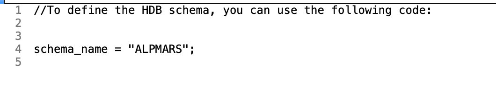
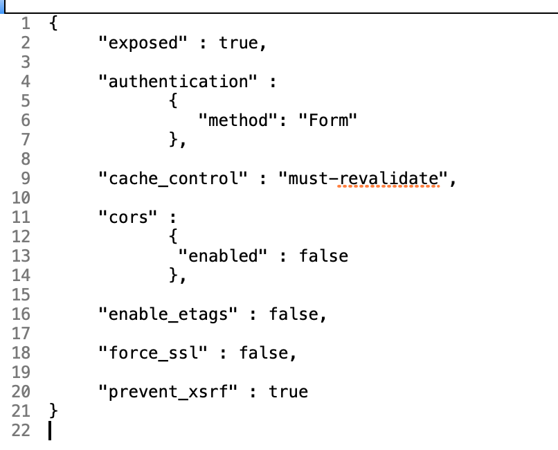

## 文件后缀解释
* hdbschema - 建立数据库 schema 使用的文件，文件名为 schema 的名字，ALPMARS.hdbschema 文件内容

说明: 上述文件激活以后，还需要配置相关的 object 权限，用户才能够看到。

* .xsapp - 一个空文件

* .xsaccess - 配置web服务相关的一些访问控制或者安全设置，文件内容如下:

* hdbdd - 数据库定义文件，后面详细介绍

## 激活文件
开发修改文件以后，需要激活文件。激活的文件会同步到 hana repository, 其他人可以得到修改后的文件更新。
如何激活文件如下图：

