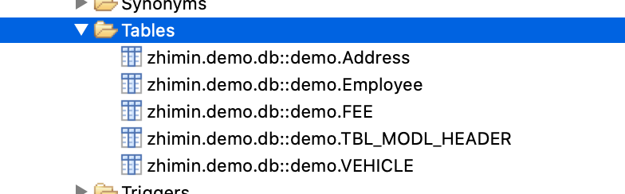
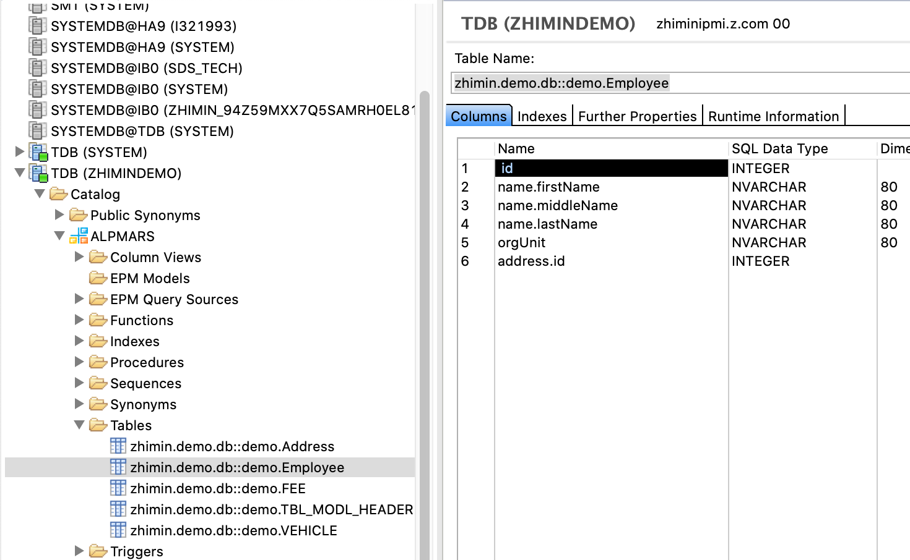

## HDBDD 文件样稿
``` js

namespace zhimin.demo.db;

@Schema : 'ALPMARS'
context demo

{
    Type HistT {
        CREATED_BY: TYPE.SString;
        CREATED_ON: TYPE.SDate;
        CHANGED_BY: TYPE.SString;
        CHANGED_ON: TYPE.SDate;
    };
    
    context TYPE {
        type UUID: String(32);
        type DictCode: String(10);
        type BusinessKey: Integer;
        type SString: String(40);
        type MString  : String(60);
        type LString  : String(255);
        type VLString : String(1024);
        type Boolean: String(1);
        type Flag:String(1);
        type SDate: UTCTimestamp;
        type Count:Integer;
        type Money:BinaryFloat;
        type Percentage:BinaryFloat;
    };
    
    @Catalog.tableType : #COLUMN 
    Entity TBL_MODL_HEADER {
        key MODEL_KEY: TYPE.UUID;
        MODEL_ID: TYPE.BusinessKey;
        SEGMENT_KEY: TYPE.UUID; //Association to SGMT.USR_SEGMENT;
        MODEL_NAME: TYPE.MString;
        MODEL_STATE: TYPE.SString;
        HISTORY: HistT;
        MODEL_DEL: TYPE.Boolean;
    };

    //车辆表
    entity VEHICLE {
        key UID                 : Integer;
            VIN                 : String(20);
            ENGINE_NO           : String(18);
            PLATE_NUMBER        : String(20);
            DOC_NUMBER          : String(18);
            CARD_ID             : String(18);
            MODEL               : String(100);
            MAKER               : String(100);
            LICENSE_VALID_FROM  : LocalDate;
            LICENSE_VALID_TO    : LocalDate;
            OP_CERT_NUMBER      : String(20);
            OP_CERT_VALID_FROM  : LocalDate;
            OP_CERT_VALID_TO    : LocalDate;
            PURCHASE_DATE        : LocalDate;
            DELETE_FLAG         : String(1) default 0;
            EFENCE_FLAG         : String(1) default 0;
    }
    technical configuration {
        column store;
        index VEHICLE_PLATE_NUMBER_INDEX on (PLATE_NUMBER) ;
    };
    

    //车辆服务费表
    @Catalog.tableType : #COLUMN 
    Entity FEE {
        key UID            : String(32);
            REF_VEHICLE    : association  to VEHICLE { UID };
            CREATED_ON     : UTCTimestamp;
            CREATED_BY     : String(50);
            CHANGED_ON     : UTCTimestamp;
            CHANGED_BY     : String(50);
            FEE_START_DATE : LocalDate;
            FEE_END_DATE   : LocalDate;
            FEE            : BinaryFloat;
            CURRENCY_CODE  : String(3) default 'CNY';
            DELETE_FLAG    : String(1) default 0;
    };

      type Name : String(80);
      
       type FullName {
            firstName : Name;
            middleName : Name;
            lastName : Name;
      };

       
       entity Employee {
            key id : Integer;
            name : FullName;
            orgUnit : Name;
            address : Association[0..1] to Address; //Association definition
      };
      
       entity Address {
            key id : Integer;
            street : Name;
            number : Integer;
            zipCode : String(30);
            city : Name;
            countryCode : String(2);
      };
      
       view OrgUnitHeadCountGermany as select from Employee {
            orgUnit,
            count(id) as headCount
      }
      where Employee.address.countryCode = 'DE' //Association usage
      group by orgUnit;

};

```

## 对应生成的数据库表




## associate 和 type 类型生成的表字段




## Data-Type Mapping from SAP HANA to CDS
[SAP HANA to CDS Data-Type Mapping](https://help.sap.com/viewer/09b6623836854766b682356393c6c416/2.0.02/en-US/a83fe9b8de1c4f4bbee3eea675851a04.html)
| SAP HANA Type (hdbtable) | CDS Type (hdbdd) |
| :------------------------------|: --------------------| 
|    NVARCHAR                      |   String                   |
|    SHORTTEXT                     |   String                  |
|    NCLOB | LargeString |
|    TEXT   |   LargeString |
|   VARBINARY |   Binary |
|   BLOB  |  LargeBinary  |
|  INTEGER  |   Integer   |
|   INT |   Integer  |
|   BIGINT   |   Integer64   |
|  DECIMAL(p,s)  |   Decimal(p,s)   |
|  DECIMAL    |   DecimalFloat  | 
|  DOUBLE  |   BinaryFloat   |
|   DAYDATE   |   LocalDate   |
|   DATE   |    LocalDate |
| SECONDTIME |   LocalTime   |
|  TIME   |   LocalTime    |
|  SECONDDATE   |   UTCDateTime   |
|   LONGDATE    |    UTCTimestamp    |
|  TIMESTAMP    |   UTCTimestamp   |
|   ALPHANUM    |  hana.ALPHANUM |
| SMALLINT | hana.SMALLINT |
| TINYINT | hana.TINYINT |
| SMALLDECIMAL | hana.SMALLDECIMAL |
| REAL | hana.REAL |
| VARCHAR |  hana.VARCHAR  |
| CLOB  | hana.CLOB  |
| BINARY | hana.BINARY |
| ST_POINT | hana.ST_POINT |
| ST_GEOMETRY |  hana.ST_GEOMETRY |


## HANA CDS LocalDate & UTCTimestamp
LocalDate could be mapping to DATE or DAYDATE
UTCTimestamp could be mapping to LONGDATE or TIMESTAMP
