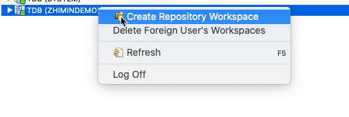
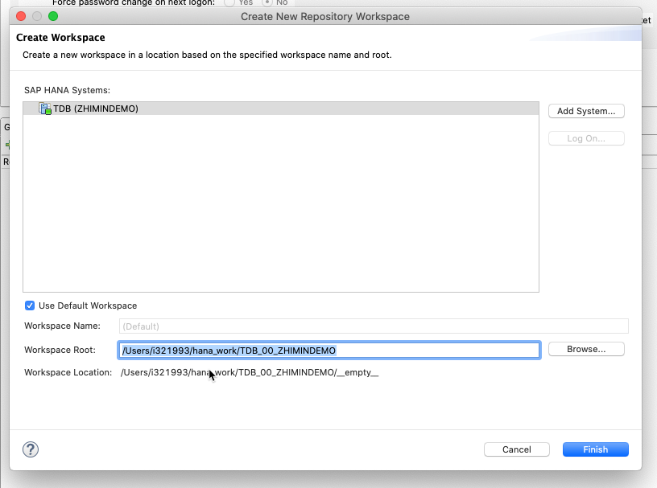
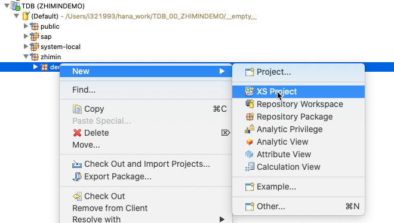
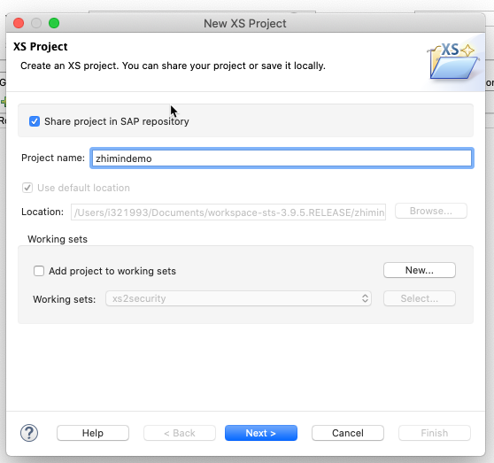
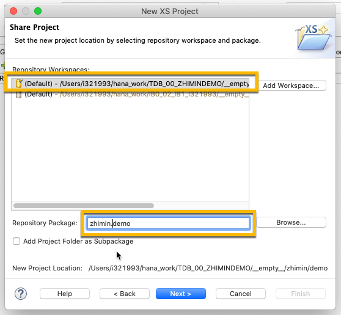
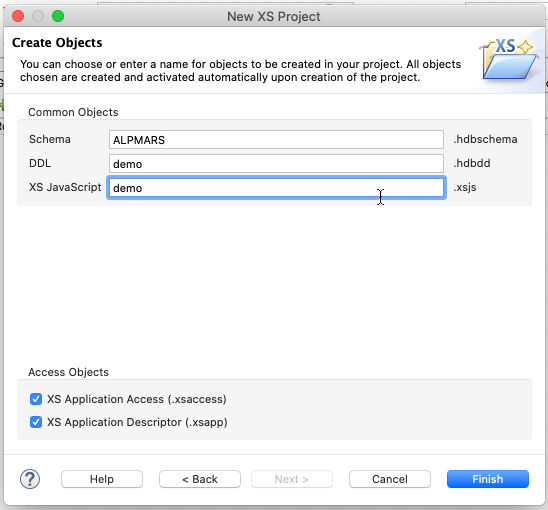
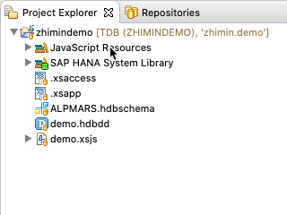
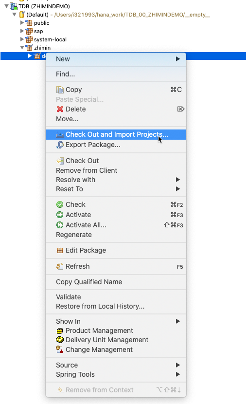

# HANA Studio

## 建立开发环境

* 建立用户 zhimindemo, 授权 CONTENT_ADMIN 角色
* 使用 zhimindemo/Welcome@123 登陆
* 建立包 zhimin.demo 
* 右键 Create Repository Workspace

* 在包 zhimin.demo 右键 create XS Project

* 最终形成的项目结构

## 切换HANA Studio 的 Perspective
* 在 SAP HANA Development 模式下

  
  ** 我们可以看到本地 workspace 下的所有包结构，并且可以 checkout 项目
  
  
* 在 SAP HANA Administration Console 模式下
  
