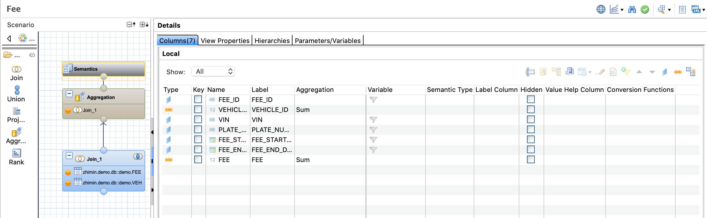

## 图形化建模

### 创建 Fee.calculationview

### 添加表对象

### 建立关系

### 建立数据映射

### 修改类型

### 数据预览

## 查看实际生成的数据库对象
实际的数据库对象由 _SYS_BIC 生成

## 更多的参考链接
[https://sap.github.io/cloud-s4ext/week-4/unit-4/](https://sap.github.io/cloud-s4ext/week-4/unit-4/)

[Understanding a Graphical Calculation View in SAP HANA](http://teachmehana.com/graphical-calculation-view-sap-hana/)

[Graphical Calculation View Nodes - JOIN](http://teachmehana.com/graphical-calculation-view-sap-hana-2/)

[Filters:Type 1 - SAP HANA Constant Filters](http://teachmehana.com/sap-hana-filters-graphical-view/)

[Filters:Type 2 - SAP HANA Variables](http://teachmehana.com/sap-hana-variables-graphical-views/)

[Filters:Type 3 - SAP HANA Input Parameters](http://teachmehana.com/sap-hana-input-parameters-graphical-view/)

[Calculated column in SAP HANA](http://teachmehana.com/sap-hana-calculated-column-view/)

[Restricted column in SAP HANA](http://teachmehana.com/sap-hana-restricted-column/)

[Rank node in SAP HANA Calculation View](http://teachmehana.com/rank-node-sap-hana-calculation-view/)

[Aggregation node in SAP HANA Calculation View](http://teachmehana.com/aggregation-node-sap-hana-calculation-view/)

[SAP HANA Union node in Calculation View](http://teachmehana.com/sap-hana-union-node-calculation-view/)