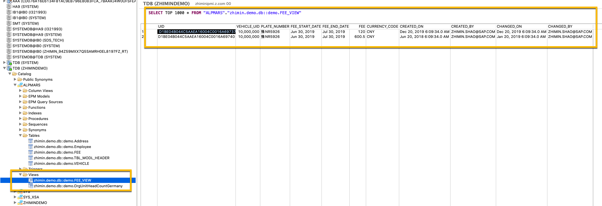

## 创建视图在 demo.hdbdd 文件，把表 Fee 中 DELETE_FLAG=1 的数据过滤掉
 
 ``` sql
 view FEE_VIEW as select from FEE {
     UID,
     REF_VEHICLE.UID as VEHICLE_UID,
     REF_VEHICLE.PLATE_NUMBER,
     FEE_START_DATE,
     FEE_END_DATE,
     FEE,
     CURRENCY_CODE,
     CREATED_ON,
     CREATED_BY,
     CHANGED_ON,
     CHANGED_BY
 }
 WHERE FEE.DELETE_FLAG = 0;
 ```
查看生成的视图结构及数据



## 暴露 ODATA 

``` js
service namespace "zhimin.demo.services"  { 
    "zhimin.demo.db::demo.FEE_VIEW" as "FeeView" key ("UID")
    create forbidden
    update forbidden
    delete forbidden;
}
```
